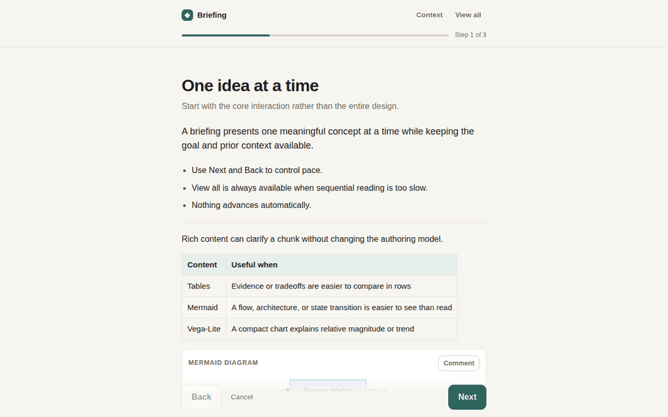
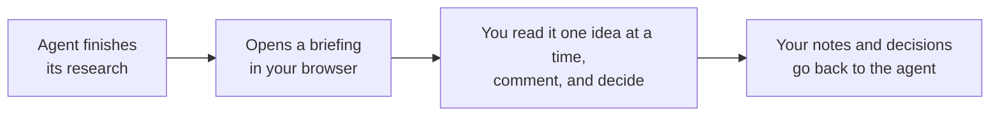
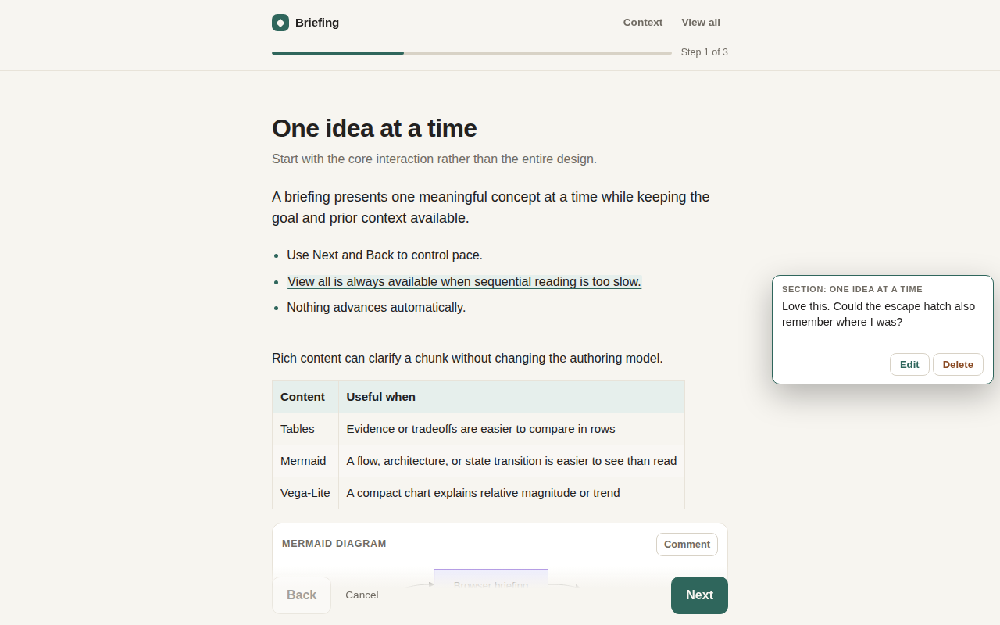
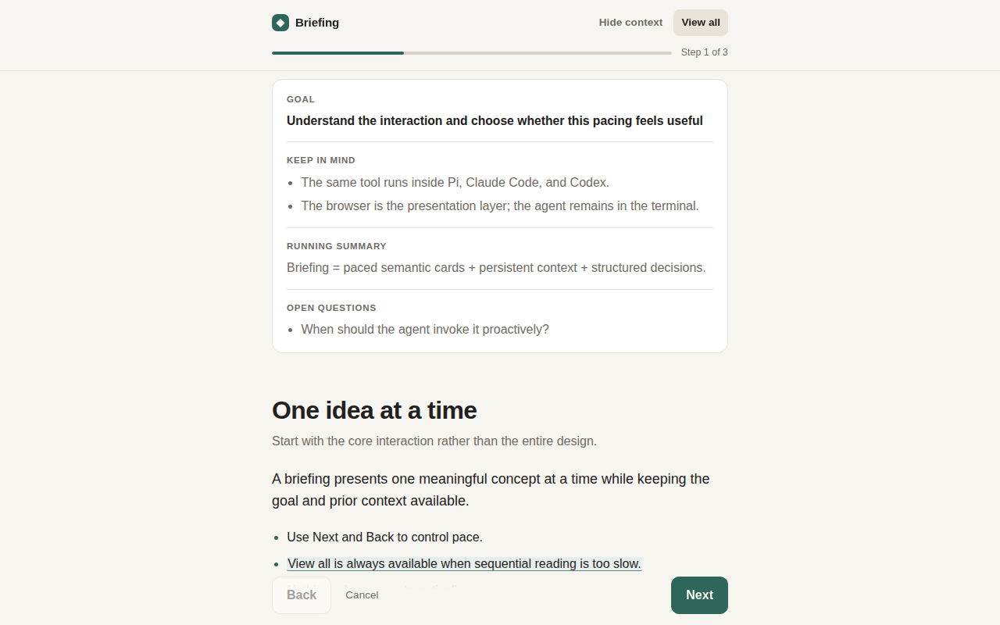
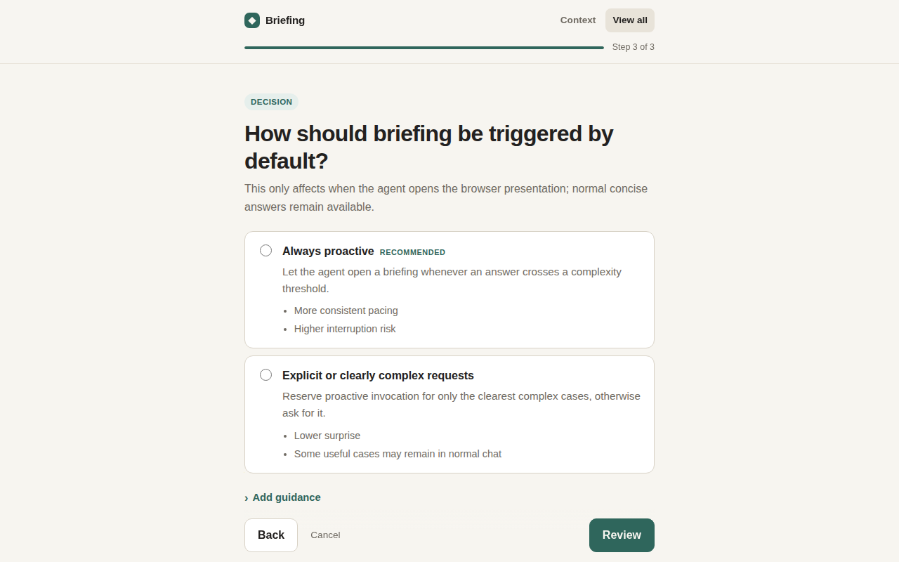
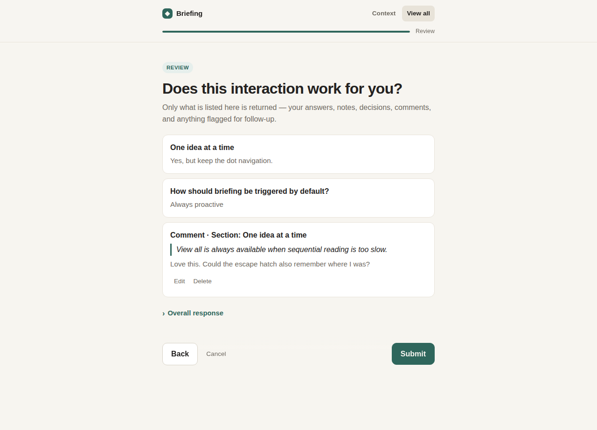
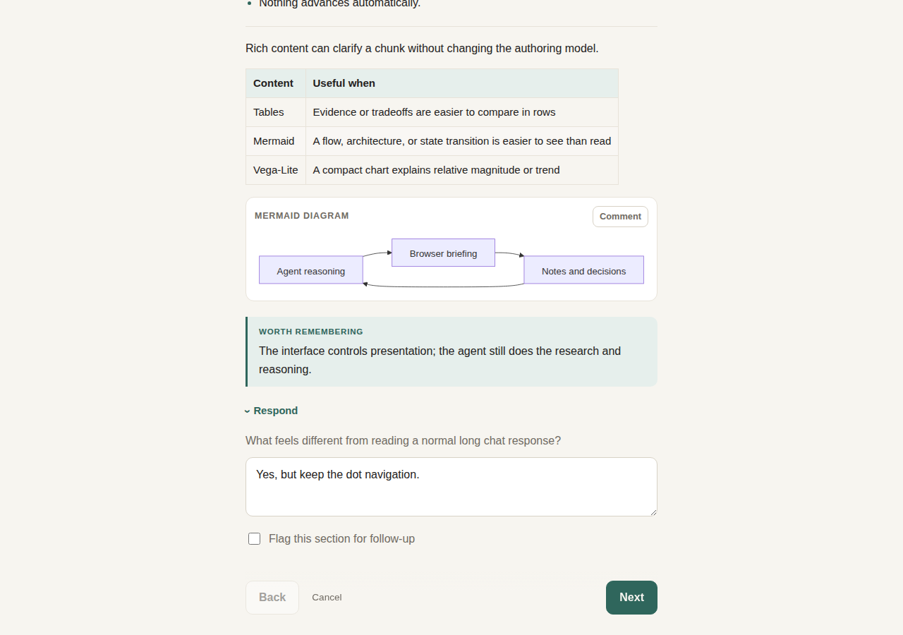
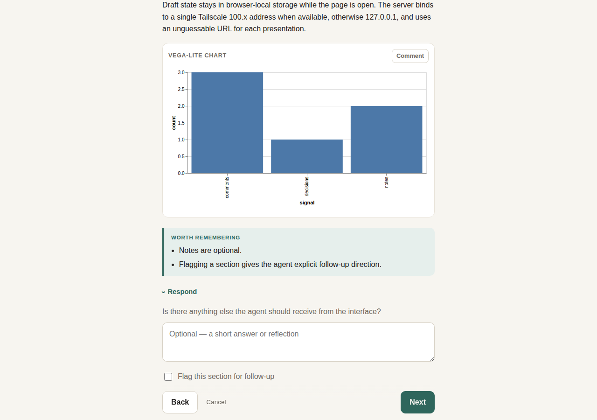

# briefing

**Paced browser briefings for coding agents.** When Claude Code, Codex, Pi, or any agent
that speaks MCP has something too long or too layered for a chat reply, it opens a briefing
in your browser instead: one idea per screen, context one click away, inline comments on
anything you select, decision cards with a recommendation, and a review screen before you
send it back. Only what you wrote returns to the agent.





## Why

- **Long agent answers don't get read.** A wall of text in a terminal is skimmed, then
  argued with from memory. A briefing paces the same content so each idea lands before the
  next one.
- **Feedback should be precise.** Select any sentence, table cell, diagram node, or chart and
  comment on exactly that. The agent gets the quoted passage with your note, not a paraphrase.
- **Decisions need context first.** Decision cards come after the chunks that justify them,
  with the recommended option first and its tradeoffs spelled out.
- **It survives everything.** Drafts save as you type. If the agent's process dies, or you
  switch from laptop to phone, the briefing picks up where you left off, and the agent can
  fetch your answers later.

## A tour

| | |
|---|---|
|  |  |
| Select text, press **Comment**, and the note lives next to the passage. | The **Context** panel keeps the goal and stable facts one click away. |
|  |  |
| Decisions come with a recommendation and honest tradeoffs. | The review screen shows exactly what goes back, and nothing else. |
|  |  |
| Markdown, GFM tables, code, and Mermaid diagrams render inline; nodes and edges are commentable. | Vega-Lite charts too, all served from the binary with no CDN. |

Try it yourself: `briefing demo`.

## Quick start

**1. Install** (macOS arm64, Linux arm64/amd64 prebuilt; one static binary):

```sh
mise use -g github:JacobHayes/briefing@latest
# or: cargo install --git https://github.com/JacobHayes/briefing --locked
```

**2. Connect your agent:**

| Harness | Setup | Notes |
|---|---|---|
| Claude Code | `claude mcp add --scope user briefing -- briefing mcp` | [integrations/claude-code.md](integrations/claude-code.md) |
| Codex | `[mcp_servers.briefing]` with `command = "briefing"`, `args = ["mcp"]`, `tool_timeout_sec = 14400` | [integrations/codex.md](integrations/codex.md) |
| Pi | `pi install git:github.com/JacobHayes/briefing` | extension + skill, [integrations/pi](integrations/pi/briefing.ts) |
| Anything else | `briefing present presentation.json` | JSON in, feedback out |

Optionally link `skills/briefing` into the harness's skills directory so the model gets the
same "when to brief" guidance everywhere; the MCP server and Pi extension already carry it.

**3. Ask for one.** Say "brief me on the options for X" or just let the agent decide: it is
told to open a briefing whenever an answer crosses a complexity threshold and to stay in
chat for anything short.

## How it works

`brief_user` validates the content, starts an embedded page server inside the MCP process
if one isn't running, and returns the link at once so the agent can show it to you (you may
be on a different machine from the agent). `await_briefing` then blocks until you press
**Submit** and returns your feedback as MCP `structuredContent`:

```jsonc
{
  "status": "completed",
  "briefingId": "7rJ-tS8jIOb8SPX5",
  "feedback": {
    "chunks":      [{ "title": "...", "status": "revisit", "checkpoint": "...", "note": "..." }],
    "decisions":   [{ "question": "...", "selected": "...", "note": "..." }],
    "annotations": [{ "location": "...", "quote": "...", "comment": "...", "target": { "..." : "..." } }],
    "overallNote": "..."
  },
  "instructions": "Respond only to this feedback ..."
}
```

Each result carries an `instructions` field telling the model what to do next; the text
block is a one-line summary because Claude Code hands the model only the structured part.
All three tools (`brief_user`, `await_briefing`, `cancel_briefing`) declare an
`outputSchema`. Caps: 500 inline comments, 4 000-character comments, 20 000-character notes.

The page itself is a single calm reading column: `Step X of Y`, Back and Next, an always
available **View all**, and no timers or auto-advance. The full interaction model, the
content contract the agent follows, and the non-goals are in
[docs/design.md](docs/design.md).

### Long waits

A briefing can take an hour; most MCP clients time out a tool call in a minute. The server
reads `clientInfo.name` and capabilities from the MCP handshake and picks a hold strategy per
client, with no extra tool parameters:

| Client (from handshake) | Hold | Budget before returning `pending` |
|---|---|---|
| Codex | form elicitation (Codex pauses its tool timeout while one is open; the server cancels it when the browser submits, declining it cancels the briefing) | 4 h |
| Claude Code, VS Code | `notifications/progress` every 10 s (Claude Code's idle timer resets on progress; VS Code has no timeout) | 24 h |
| Gemini CLI | progress | 570 s |
| Goose | progress | 280 s |
| Cursor, Cline, Zed, Continue, OpenCode, Windsurf, Pi's MCP adapter, unknown | progress | 50 s |

When the budget runs out the tool returns `status: "pending"` with the `briefingId` and the
model calls `await_briefing` again; you never notice. Claude Code moves calls longer than
two minutes into a background task and notifies the model on completion; the tool text tells
the model to wait for that rather than poll. `--hold` and `--max-wait-secs` override the
plan. Sources and per-client details: [docs/harness-timeouts.md](docs/harness-timeouts.md).

Pi's own extension has no timeout to work around, so it exposes a single blocking
`brief_user` that shows the link in Pi's UI and returns the feedback directly.

## Recovery and hand-off

Every briefing is mirrored to `$XDG_STATE_HOME/briefing/briefings/<id>.json` (default
`~/.local/state/...`): the presentation, your in-progress draft, and the submitted result.
Nothing depends on the process that created it staying alive:

- **Agent disconnected after you submitted:** `await_briefing` (or `briefing await <id>`)
  from any later process returns the stored result. Results are kept for 6 hours.
- **Agent died before you submitted:** `await_briefing` with the id returns
  `status: "reopened"` and a fresh link; your draft is intact. The old link is dead because
  each process serves on its own port. The id is shown on the page's Submitted screen and
  error banner, in `brief_user` output, and by `briefing status`.
- **Switching devices mid-briefing:** drafts are saved server-side (debounced, revisioned;
  the page adopts a newer draft on focus) and cached in localStorage, so opening the same
  link elsewhere continues where you left off.

Unanswered briefings expire after 14 days. One result per briefing, no history.

## CLI

```sh
briefing demo                      # open the bundled demo
briefing present spec.json         # print the user's feedback as text; --json for JSON
briefing schema                    # JSON Schema for brief_user input
briefing mcp                       # MCP over stdio
briefing serve --mcp               # long-lived hub (see below)
briefing status                    # list known briefings (waiting / completed / cancelled)
briefing await <briefingId>        # recover one: re-serve it if still open, print the result if not
```

`present` prints the URL (and bind diagnostics) on stderr, or JSON events with `--json`, and
the result on stdout. Exit codes: 0 completed, 2 cancelled, 3 still pending after
`--wait-seconds`, 130 interrupted.

| Flag / env | Meaning |
|---|---|
| `--bind auto\|local\|tailscale` (`BRIEFING_BIND`) | Where the embedded server listens; `auto` prefers the Tailscale address |
| `--no-open` (`BRIEFING_NO_OPEN`) | Never try to open a browser |
| `--on-create 'cmd'` (`BRIEFING_ON_CREATE`) | Shell hook run with `BRIEFING_URL/ID/TITLE`, e.g. to push the link to ntfy from a headless box |
| `--hub URL` (`BRIEFING_HUB`) | Use a hub instead of the embedded server |
| `BRIEFING_STATE_DIR` | Where records are mirrored (default `$XDG_STATE_HOME/briefing/briefings`) |
| `BRIEFING_BROWSER`, `BRIEFING_LOG` | Override the browser opener; tracing filter |

## Hub mode (optional)

The embedded server only helps when the agent process can reach your browser. For a session
running elsewhere (Claude Code web, Codex cloud, a headless box), `briefing serve` runs one
long-lived server that any harness on any machine can use:

```sh
briefing serve --mcp --on-create 'curl -s -d "$BRIEFING_URL" https://ntfy.sh/my-topic'
```

- Binds to this node's Tailscale 100.x address when Tailscale is running, else loopback.
- Serves briefing pages, a dashboard at `/` listing briefings awaiting feedback (with links and
  progress) and recent results, the agent API (`/agent/briefings`), and with `--mcp` a
  streamable-HTTP MCP endpoint at `/mcp`. There is no authentication: the tailnet is the
  perimeter, and each briefing URL still carries its own capability token.
- `--finished-ttl 6h` / `--active-ttl 14d` tune retention; the embedded server uses the same
  defaults.
- `--public-origin https://briefings.example` when fronted by a reverse proxy (TLS lives there).
- `--on-create` runs a shell command with `BRIEFING_URL/ID/TITLE` so a remote session
  can push the URL to your phone (the hub cannot open your browser).
- Clients either point the stdio server at it (`briefing mcp --hub URL`) or connect to
  `/mcp` directly. `briefing --hub URL await|cancel|status` work against a hub.

## Security model

- Bind only to loopback or one Tailscale address; never all interfaces.
- Every briefing URL carries a random capability token; the agent side uses a separate id.
- `Host` must match the bound origin on every request; `Origin` must match on browser POSTs.
- Strict CSP with a per-page nonce; renderer libraries are served from the binary.
- Presentation and feedback sizes are capped. Records are written to the user's state
  directory with owner-only permissions and deleted 6 h after finishing (14 days if never
  answered).
- No authentication on the hub's agent API or dashboard: run it on a private network.

## Development

```sh
mise run check       # fmt --check, clippy -D warnings, tests
mise use -g github:JacobHayes/briefing@latest   # or: cargo install --path . --locked
mise run assets:update
cargo zigbuild --release --target aarch64-apple-darwin   # any release target, from Linux
```

The build embeds the browser renderer libraries (marked, DOMPurify, highlight.js, Mermaid,
Vega, Vega-Lite, vega-embed). `build.rs` installs the versions pinned in
`assets/package-lock.json` with `npm ci` (or `bun install`) on first build, so Node or Bun must
be available; offline builds can point `BRIEFING_VENDOR_DIR` at a directory holding the
seven files.

CI (`.rwx/ci.yml`) checks and cross-builds every push; releases (`.rwx/release.yml`) are
immutable calver tags `vYYYY.MM.DD.N`, published daily when `main` moved. The workflow files
carry the details. Fresh releases can be hidden by mise's `minimum_release_age` for a while;
`MISE_MINIMUM_RELEASE_AGE=0` overrides. TLS is rustls + ring with bundled webpki roots, so no
platform SDKs are needed to cross-compile.

Tests cover validation, the hub state machine, the on-disk store, drafts, host/origin checks,
the full HTTP flow, recovery of a briefing across processes, and the MCP server driven over
stdio (progress hold, pending/await/cancel, the Codex elicitation hold, and recovery).
