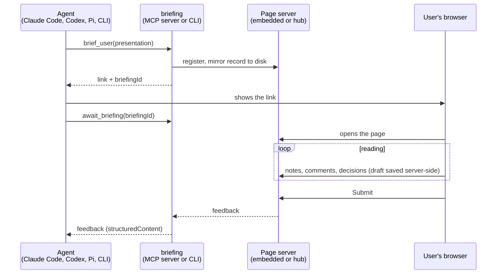

# briefing

A paced browser briefing surface for coding agents, packaged so the same tool works from Pi,
Claude Code, Codex, or anything else that can run a CLI or speak MCP.

When an answer is too long or too dependent on earlier context to read as one chat message,
the agent calls `brief_user` with a structured presentation, gets a link back to show the user,
and calls `await_briefing` for their feedback. The user gets a quiet reading column in the
browser: one semantic chunk per screen, a Context panel one click away, decision cards,
always-on inline commenting, and a final review screen. Only user-authored signal comes back:
notes, checkpoint answers, inline comments with their quoted passages, flagged sections, and
decisions.



The record on disk is what makes this robust: if the agent's process dies at any point, a
later `await_briefing` with the same id returns the stored feedback or re-serves the page with
the draft intact ([recovery](#recovery-and-hand-off)).

## Install

Prebuilt static binaries (macOS arm64, Linux arm64/amd64) are attached to every GitHub
release, so mise can install it straight from GitHub:

```sh
mise use -g github:JacobHayes/briefing@latest          # newest build (vYYYY.MM.DD.N)
```

Or build from source:

```sh
cargo install --git https://github.com/JacobHayes/briefing --locked
```

The build embeds the browser renderer libraries (marked, DOMPurify, highlight.js, Mermaid,
Vega, Vega-Lite, vega-embed). `build.rs` installs the versions pinned in
`assets/package-lock.json` with `npm ci` (or `bun install`) on first build, so Node or Bun must
be available; offline builds can point `BRIEFING_VENDOR_DIR` at a directory holding the
seven files. The result is a single static binary with no runtime dependencies and no CDN use.

## Harness setup

| Harness | Setup | Details |
|---|---|---|
| Claude Code | `claude mcp add --scope user briefing -- briefing mcp` | [integrations/claude-code.md](integrations/claude-code.md) |
| Codex | `[mcp_servers.briefing]` with `tool_timeout_sec` raised | [integrations/codex.md](integrations/codex.md) |
| Pi | `pi install git:github.com/JacobHayes/briefing` (extension + skill) | [integrations/pi](integrations/pi/briefing.ts) |
| Anything | `briefing present presentation.json` | below |

Link `skills/briefing` into each harness's skills directory so the model gets the same
"when to use it" guidance everywhere.

## How the blocking call stays alive

`briefing mcp` is self-contained: the MCP process starts an embedded HTTP server on the
first `brief_user` and serves the page itself. `brief_user` returns at once with the link
(so the model can show it, wherever the user's browser is); `await_briefing` then blocks
until the user submits, which can take longer than most clients' per-call timeouts. Every MCP client
identifies itself in the `initialize` handshake (`clientInfo.name` plus capabilities), so the
server picks a plan from that with no extra tool parameters:

| Client (from handshake) | Hold | Budget before returning `pending` |
|---|---|---|
| Codex | form elicitation (Codex pauses its tool timeout while one is open; the server cancels it when the browser submits, declining it cancels the briefing) | 4 h |
| Claude Code, VS Code | `notifications/progress` every 10 s (Claude Code's idle timer resets on progress; VS Code has no timeout) | 24 h |
| Gemini CLI | progress | 570 s |
| Goose | progress | 280 s |
| Cursor, Cline, Zed, Continue, OpenCode, Windsurf, Pi's MCP adapter, unknown | progress | 50 s |

When the budget runs out the tool returns `status: "pending"` with a `briefingId` and the
model continues with `await_briefing`; the human never notices. `--hold` and
`--max-wait-secs` override the plan. Claude Code moves any MCP call longer than two minutes
into a background task and notifies the model when it completes; the tool text tells the
model to wait for that rather than poll. Details and sources:
[docs/harness-timeouts.md](docs/harness-timeouts.md).

Pi's own extension has no timeout to work around, so it exposes a single blocking
`brief_user` that shows the link in Pi's UI and returns the feedback directly.

## Tool results

Results come back as MCP `structuredContent` (Claude Code hands the model only that, and
drops text blocks, so nothing important lives in text). Each result carries an
`instructions` field telling the model what to do next.

| Tool | `structuredContent` |
|---|---|
| `brief_user` | `{status: "open", briefingId, url, openedBrowser, scope, instructions}` |
| `await_briefing` | `{status: "completed" \| "cancelled" \| "pending" \| "reopened", briefingId, url?, feedback?, instructions}` where `feedback` is `{cancelled, chunks[{title, status, checkpoint, note}], decisions[{question, selected, note}], annotations[{location, quote, comment, target?}], overallNote}`; `reopened` means a briefing from an earlier process is being served again at `url` |
| `cancel_briefing` | `{briefingId, cancelled}` |

All three declare an `outputSchema`. The text block is a one-line summary only, so nothing
is sent twice. Clients that negotiated an MCP version older than 2025-06-18 (no
`structuredContent`) get an error instead of silently losing the feedback. Caps: 500
inline comments, 4 000-character comments, 20 000-character notes.

## CLI

```sh
briefing demo                      # open the bundled demo
briefing present spec.json         # print the user's feedback as text; --json for JSON
briefing schema                    # JSON Schema for brief_user input
briefing mcp                       # MCP over stdio
briefing serve --mcp               # long-lived hub (see below)
briefing status                    # list known briefings (waiting / completed / cancelled)
briefing await <briefingId>        # recover one: re-serve it if still open, print the result if not
```

`present` prints the URL (and bind diagnostics) on stderr, or JSON events with `--json`, and
the result on stdout. Exit codes: 0 completed, 2 cancelled, 3 still pending after
`--wait-seconds`, 130 interrupted.

Global flags and their env vars:

| Flag / env | Meaning |
|---|---|
| `--bind auto\|local\|tailscale` (`BRIEFING_BIND`) | Where the embedded server listens; `auto` prefers the Tailscale address |
| `--no-open` (`BRIEFING_NO_OPEN`) | Never try to open a browser |
| `--on-create 'cmd'` (`BRIEFING_ON_CREATE`) | Shell hook run with `BRIEFING_URL/ID/TITLE`, e.g. to push the link to ntfy from a headless box |
| `--hub URL` (`BRIEFING_HUB`) | Use a hub instead of the embedded server |
| `BRIEFING_STATE_DIR` | Where records are mirrored (default `$XDG_STATE_HOME/briefing/briefings`) |
| `BRIEFING_BROWSER`, `BRIEFING_LOG` | Override the browser opener; tracing filter |

## Recovery and hand-off

Every briefing is mirrored to `$XDG_STATE_HOME/briefing/briefings/<id>.json` (default
`~/.local/state/...`): the presentation, the user's in-progress draft, and the submitted
result. Nothing depends on the process that created it staying alive:

- **Agent disconnected after you submitted:** `await_briefing` (or `briefing await <id>`)
  from any later process returns the stored result. Records are kept 6 h after they finish.
- **Agent died before you submitted:** `await_briefing` with the id returns `status:
  "reopened"` and a fresh link; the draft is intact. The old link is dead because each process
  serves on its own port. The id is shown on the page's error banner and Submitted screen,
  in `brief_user` output, and by `briefing status`.
- **Switching devices mid-briefing:** the draft is saved server-side (debounced, with a
  revision; the page adopts a newer draft on focus) and cached in localStorage, so opening the
  same link elsewhere continues where you left off.

Unanswered briefings expire after 14 days. There is no feedback history: one result per briefing.

## Hub mode (optional)

The embedded server only helps when the agent process can reach your browser. For a session
running elsewhere (Claude Code web, Codex cloud, a headless box), `briefing serve` runs one
long-lived server that any harness on any machine can use:

```sh
briefing serve --mcp --on-create 'curl -s -d "$BRIEFING_URL" https://ntfy.sh/my-topic'
```

- Binds to this node's Tailscale 100.x address when Tailscale is running, else loopback.
- Serves briefing pages, a dashboard at `/` listing briefings awaiting feedback (with links and
  progress) and recent results, the agent API (`/agent/briefings`), and with `--mcp` a
  streamable-HTTP MCP endpoint at `/mcp`. There is no authentication: the tailnet is the
  perimeter, and each briefing URL still carries its own capability token.
- `--finished-ttl 6h` / `--active-ttl 14d` tune retention; the embedded server uses the same
  defaults.
- `--public-origin https://briefings.example` when fronted by a reverse proxy (TLS lives there).
- `--on-create` runs a shell command with `BRIEFING_URL/ID/TITLE` so a remote session
  can push the URL to your phone (the hub cannot open your browser).
- Clients either point the stdio server at it (`briefing mcp --hub URL`) or connect to
  `/mcp` directly. `briefing --hub URL await|cancel|status` work against a hub.

## Security model

- Bind only to loopback or one Tailscale address; never all interfaces.
- Every briefing URL carries a random capability token; the agent side uses a separate id.
- `Host` must match the bound origin on every request; `Origin` must match on browser POSTs.
- Strict CSP with a per-page nonce; renderer libraries are served from the binary.
- Presentation and feedback sizes are capped. Records are written to the user's state
  directory with owner-only permissions and deleted 6 h after finishing (14 days if never
  answered).
- No authentication on the hub's agent API or dashboard: run it on a private network.

## Development

```sh
mise run check       # fmt --check, clippy -D warnings, tests
mise run install
mise run assets:update
cargo zigbuild --release --target aarch64-apple-darwin   # any release target, from Linux
```

CI (`.rwx/ci.yml`) checks and cross-builds every push; releases (`.rwx/release.yml`) are
immutable calver tags `vYYYY.MM.DD.N`, published daily when `main` moved. The workflow files
carry the details. Fresh releases can be hidden by mise's `minimum_release_age` for a while;
`MISE_MINIMUM_RELEASE_AGE=0` overrides. TLS is rustls + ring with bundled webpki roots, so no
platform SDKs are needed to cross-compile.

Tests cover validation, the hub state machine, the on-disk store, drafts, host/origin checks,
the full HTTP flow, recovery of a briefing across processes, and the MCP server driven over
stdio (progress hold, pending/await/cancel, the Codex elicitation hold, and recovery).
