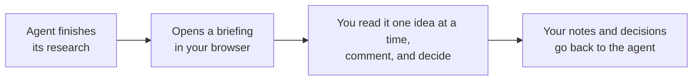

# briefing

**Paced browser briefings for coding agents.** When Claude Code, Codex, Pi, or any agent
that speaks MCP has something too long or too layered for a chat reply, it opens a briefing
in your browser instead: one idea per screen, context one click away, inline comments on
anything you select, decision cards with a recommendation (on the chunk they depend on, or
after all of them), a free-standing Notes panel, and a review screen before you send it back.
Only what you wrote returns to the agent.




## Why

- **Long agent answers don't get read.** A wall of text in a terminal is skimmed, then
  argued with from memory. A briefing paces the same content so each idea lands before the
  next one.
- **Feedback should be precise.** Select any sentence, table cell, diagram node, or chart and
  comment on exactly that. The agent gets the quoted passage with your note, not a paraphrase.
- **Decisions need context first.** Decision cards sit at the bottom of the chunk that
  justifies them, or after all the chunks when a choice spans the whole briefing, with the
  recommended option first and its tradeoffs spelled out.
- **It survives everything.** Drafts save as you type. If the agent's process dies, or you
  switch from laptop to phone, the briefing picks up where you left off, and the agent can
  fetch your answers later.

## A tour

| | |
|---|---|
|  |  |
| Select text, press **Comment**, and the note lives next to the passage. | The **Context** panel keeps the goal and stable facts one click away. |
|  |  |
| Decisions come with a recommendation and honest tradeoffs. | The review screen shows exactly what goes back, and nothing else. |
|  |  |
| Markdown, GFM tables, code, and Mermaid diagrams render inline; nodes and edges are commentable. | Vega-Lite charts too, all served from the binary with no CDN. |

Try it yourself: `briefing demo`.

## Quick start

**1. Install** (macOS arm64, Linux arm64/amd64 prebuilt; one static binary):

```sh
mise use -g github:JacobHayes/briefing@latest
# or: cargo install --git https://github.com/JacobHayes/briefing --locked
```

**2. Connect your agent:**

| Harness | Setup | Notes |
|---|---|---|
| Claude Code | `claude mcp add --scope user briefing -- briefing mcp` | [integrations/claude-code.md](integrations/claude-code.md) |
| Codex | `[mcp_servers.briefing]` with `command = "briefing"`, `args = ["mcp"]`, `tool_timeout_sec = 14400` | [integrations/codex.md](integrations/codex.md) |
| Pi | `pi install git:github.com/JacobHayes/briefing` | extension, [integrations/pi](integrations/pi/briefing.ts) |
| Anything else | `briefing present presentation.json` | JSON in, feedback out |

Optionally link `skills/briefing` into a harness's skills directory for raw CLI use if it does
not use the MCP server or Pi extension; those integrations already carry their own guidance.

**3. Ask for one.** Say "brief me on the options for X" or just let the agent decide: it is
told to open a briefing whenever an answer crosses a complexity threshold and to stay in
chat for anything short.

## How it works

`brief_user` validates the content, starts an embedded page server inside the MCP process
if one isn't running, and returns the link at once so the agent can show it to you (you may
be on a different machine from the agent). `await_briefing` then blocks until you press
**Submit** and returns your feedback as MCP `structuredContent`:

```jsonc
{
  "status": "completed",
  "briefingId": "7rJ-tS8jIOb8SPX5",
  "feedback": {
    "chunks":      [{ "title": "...", "status": "revisit", "checkpoint": "...", "note": "..." }],
    "decisions":   [{ "question": "...", "selected": "...", "note": "..." }],
    "annotations": [{ "location": "...", "quote": "...", "comment": "...", "target": { "..." : "..." } }],
    "notes":       ["..."],
    "overallNote": "..."
  },
  "instructions": "Respond only to this feedback ..."
}
```

Each result carries an `instructions` field telling the model what to do next; the text
block is a one-line summary because Claude Code hands the model only the structured part.
All three tools (`brief_user`, `await_briefing`, `cancel_briefing`) declare an
`outputSchema`. Caps: 500 inline comments, 4 000-character comments, 100 free-standing notes,
20 000-character notes.

The page itself is a single calm reading column: `Step X of Y`, Back and Next, an always
available **View all**, and no timers or auto-advance. The full interaction model, the
content contract the agent follows, and the non-goals are in
[docs/design.md](docs/design.md).

### Long waits

A briefing can take an hour; most MCP clients time out a tool call in a minute. The server
reads `clientInfo.name` and capabilities from the MCP handshake and picks a hold strategy per
client, with no extra tool parameters: `notifications/progress` heartbeats every 10 s for
clients whose timer resets on progress or that have no timeout (Claude Code, VS Code), a form
elicitation for Codex (whose timer pauses while one is open; the server cancels it when the
browser submits, declining it cancels the briefing), and a short budget (50 s) for the
60-second clients (Cursor, Cline, Zed, Continue, OpenCode, Pi's MCP adapter, unknown).

When the budget runs out the tool returns `status: "pending"` with the `briefingId` and the
model calls `await_briefing` again; you never notice. Claude Code moves calls longer than
two minutes into a background task and notifies the model on completion; the tool text tells
the model to wait for that rather than poll. `--hold` and `--max-wait-secs` override the
plan. The per-client table, with sources, is `PROFILES` in
[src/mcp.rs](src/mcp.rs).

Pi's own extension has no client-side tool timeout to work around, so it exposes a single
blocking `brief_user` that shows the link in Pi's UI and returns the feedback directly. The
`/brief-demo` and `/brief-result` commands route through temporary command-only tools so they
exercise the same active-tool UI mechanics. When using a remote hub, individual long-poll
HTTP requests may still time out; `briefing await` treats those as pending and repolls
internally, so callers never see the timeout.

## Recovery and hand-off

Every briefing is mirrored to `$XDG_STATE_HOME/briefing/briefings/<id>.json` (default
`~/.local/state/...`): the presentation, your in-progress draft, and the submitted result.
Nothing depends on the process that created it staying alive:

- **Agent disconnected after you submitted:** `await_briefing` (or `briefing await <id>`)
  from any later process returns the stored result. Results are kept for 6 hours.
- **Agent died before you submitted:** `await_briefing` with the id returns
  `status: "reopened"` and a fresh link; your draft is intact. The old link is dead because
  each process serves on its own port. The id is shown on the page's Submitted screen and
  error banner, in `brief_user` output, and by `briefing status`.
- **Switching devices mid-briefing:** drafts are saved server-side (debounced, revisioned;
  the page adopts a newer draft on focus) and cached in localStorage, so opening the same
  link elsewhere continues where you left off.

Unanswered briefings expire after 14 days. One result per briefing, no history.

## CLI

```sh
briefing demo                      # open the bundled demo
briefing present spec.json         # print the user's feedback as text; --json for JSON
briefing schema                    # JSON Schema for presentation input
briefing guidance cli              # agent-facing CLI workflow guidance
briefing guidance pi               # Pi extension guidance as JSON
briefing guidance mcp              # MCP instructions text
briefing guidance skill            # print the CLI-focused Agent Skill markdown
briefing mcp                       # MCP over stdio
briefing serve --mcp               # long-lived hub (see below)
briefing status                    # list known briefings (waiting / completed / cancelled)
briefing await <briefingId>        # recover one: re-serve it if still open, print the result if not
```

`present` prints the URL (and bind diagnostics) on stderr, or JSON events with `--json`, and
the result on stdout. With `--json` the result is one line, the same `status` shape the MCP
tool and the hub API return:

```jsonc
{ "briefingId": "7rJ-tS8jIOb8SPX5", "status": "completed", "feedback": { "chunks": [], "decisions": [], "annotations": [], "notes": ["..."], "overallNote": "..." } }
{ "briefingId": "7rJ-tS8jIOb8SPX5", "status": "cancelled", "feedback": { "..." : "..." } }
{ "briefingId": "7rJ-tS8jIOb8SPX5", "status": "pending" }
```

Exit codes: 0 completed, 2 cancelled, 3 still pending after `--wait-seconds`, 130 interrupted.

| Flag / env | Meaning |
|---|---|
| `--bind auto\|local\|tailscale\|IP` (`BRIEFING_BIND`) | Where the server listens: `auto` prefers Tailscale, otherwise loopback; `local` uses `127.0.0.1`; `tailscale` and literal IPv4/IPv6 addresses fail instead of falling back |
| `--open true\|false` (`BRIEFING_OPEN`) | Whether this client opens new briefings in the local browser, including hub-created briefings. `serve` ignores it because the hub process stays headless |
| `--on-create 'cmd'` (`BRIEFING_ON_CREATE`) | Shell hook run with `BRIEFING_URL/ID/TITLE`, e.g. to push the link to ntfy from a headless box |
| `--hub URL` (`BRIEFING_HUB`) | Use a hub instead of the embedded server |
| `BRIEFING_STATE_DIR` | Where records are mirrored (default `$XDG_STATE_HOME/briefing/briefings`) |
| `BRIEFING_CONFIG` | Override the settings file path |
| `BRIEFING_BROWSER`, `BRIEFING_LOG` | Override the browser opener; tracing filter |

### Per-machine configuration

Briefing always reads `$XDG_CONFIG_HOME/briefing/config.toml` (default
`~/.config/briefing/config.toml`) first, then overlays environment variables, then explicit
command-line arguments. For example,

```toml
bind = "local"                    # auto | local | tailscale | literal IPv4/IPv6 address
hub = "https://briefings.example" # use a remote hub instead of the embedded server
on_create = "notify-send"         # shell hook run with BRIEFING_URL/ID/TITLE
open = false                      # do not open the system browser from this client
```

For each key, the value comes from the settings file, then `BRIEFING_<KEY>`, then the matching
argument, in increasing priority (`bind` also has a built-in `auto` default). For example
`--open true`/`--open false` override `BRIEFING_OPEN` and the file setting for commands that
create briefings, whether they use an embedded server or a hub. `serve` is a headless hub and
never opens a browser, and says so when given an explicit `--open true`. Unknown fields or an
invalid settings file fail visibly even when overridden; invalid environment values may also
fail before CLI overrides apply.
Set `BRIEFING_CONFIG` to use another file; an explicitly selected file must exist. Settings that are
per client rather than per machine (such as `--hold`) stay argument/environment only, so each MCP
client's launcher can set its own.

## Hub mode (optional)

The embedded server only helps when the agent process can reach your browser. For a session
running elsewhere (Claude Code web, Codex cloud, a headless box), `briefing serve` runs one
long-lived server that any harness on any machine can use:

```sh
briefing serve --mcp --on-create 'curl -s -d "$BRIEFING_URL" https://ntfy.sh/my-topic'
```

- Defaults to Tailscale when available, otherwise loopback. Override with `--bind`.
- Serves briefing pages, a dashboard at `/` listing briefings awaiting feedback (with links,
  progress, and a cancel action) and recent results, the agent API (`/agent/briefings`), and
  with `--mcp` a streamable-HTTP MCP endpoint at `/mcp`.
- `--finished-ttl 6h` / `--active-ttl 14d` tune retention; the embedded server uses the same
  defaults. Long-lived hubs sweep expired records in the background once a minute.
- `--public-origin https://briefings.example` when fronted by a reverse proxy (TLS lives there).
- `--on-create` runs a shell command with `BRIEFING_URL/ID/TITLE` so a remote session can push
  the URL to your phone. It applies however the briefing was created: the agent API, `/mcp`, or
  a CLI pointed at the hub. The hub never tries to open a browser itself; clients using the hub
  can still open the returned URL locally with their own `--open`/`BRIEFING_OPEN`/config setting.
- `GET /agent/briefings/{id}/wait?timeout_secs=N` answers with the same
  `{ "briefingId", "status": "completed" | "cancelled" | "pending", "feedback"? }` shape as
  the CLI's `--json` output.
- Clients either point the stdio server at it (`briefing mcp --hub URL`) or connect to
  `/mcp` directly. `briefing --hub URL await|cancel|status` work against a hub.

### Behind a reverse proxy

```sh
briefing serve --bind 127.0.0.1 --port 7789 --mcp \
  --public-origin https://briefings.example
```

`--public-origin` sets generated URLs and the allowed proxy Host/Origin; TLS stays at the
proxy. Preserve the public Host header or use the bound IP.

`bind` accepts literal IPv4/IPv6 addresses, without ports, on all config surfaces.
Explicit IPs never fall back. Wildcards (`0.0.0.0`, `::`) listen on all interfaces and need
`--public-origin` for usable links.

## Security model

- Defaults to loopback/Tailscale; other bind addresses are opt-in.
- Every briefing URL carries a random capability token; the agent side uses a separate id.
- `Host` and browser-write `Origin` checks prevent DNS rebinding and cross-site requests.
- Strict CSP with a per-page nonce; renderer libraries are served from the binary.
- Presentation and feedback sizes are capped. Records are written to the user's state
  directory with owner-only permissions and deleted 6 h after finishing (14 days if never
  answered).
- No built-in authentication. Restrict all routes through network controls or an authenticating
  proxy; block untrusted direct access. Proxy identity headers are not authentication.

## Development

```sh
mise install         # rust (+ clippy, rustfmt, release targets), zig, cargo-zigbuild, node
mise run check       # full project gate: format, generated skill, clippy -D warnings, tests, Pi extension
mise run pi:check    # focused Pi extension typecheck/smoke
mise run fix         # format, clippy --fix, regenerate skill
mise use -g github:JacobHayes/briefing@latest   # or: cargo install --path . --locked
mise run assets:update
cargo zigbuild --release --target aarch64-apple-darwin   # any release target, from Linux
```

The build embeds the browser renderer libraries (marked, DOMPurify, highlight.js, Mermaid,
Vega, Vega-Lite, vega-embed). `build.rs` installs the versions pinned in
`assets/package-lock.json` with `npm ci` (or `bun install`) on first build, so Node or Bun must
be available; offline builds can point `BRIEFING_VENDOR_DIR` at a directory holding the
seven files.

CI (`.rwx/ci.yml`) runs the non-mutating `mise run check` and cross-builds every
push; releases (`.rwx/release.yml`) are immutable calver tags `vYYYY.MM.DD.N`, published
daily when `main` moved. The release build sets `BRIEFING_VERSION` to the tag, which
`build.rs` bakes into `briefing --version`; other
builds report the Cargo version with a `-dev` suffix. The workflow files
carry the details. Fresh releases can be hidden by mise's `minimum_release_age` for a while;
`MISE_MINIMUM_RELEASE_AGE=0` overrides. TLS is rustls + ring with bundled webpki roots, so no
platform SDKs are needed to cross-compile.

Tests cover validation, the hub state machine, the on-disk store, drafts, host/origin checks,
the full HTTP flow, recovery of a briefing across processes, and the MCP server driven over
stdio (progress hold, pending/await/cancel, the Codex elicitation hold, and recovery).
